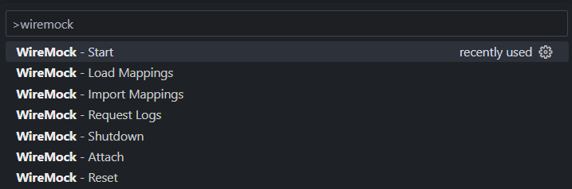

# vscode-wiremock

This extension makes it easy to start a WireMock server and to create stubbings.

## Features

Commands:

Auto-reload on changes:

JSON Schema validation:

---

## Requirements

Java

---

## Extension Settings

This extension contributes the following settings:

* `wiremock.additionalCommandArgs`: Additional command arguments

---

## Release Notes

### 0.0.1

Initial release

---
